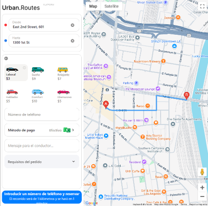
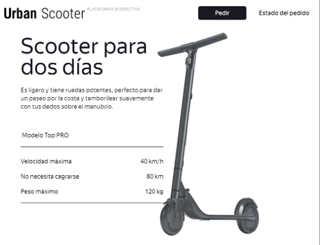
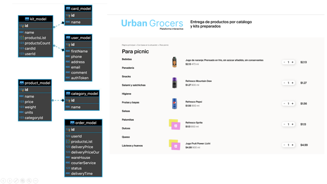

# Quality Assurance Engineer

### Sobre mi

Cuando se trata sobre informática, software, hardware, pruebas o reparación de computadoras, me sentiré siempre identificado, todos estos temas y entre otros como la historia, astronomía, aviación y en mundo aeroespacial siempre han sido muy interesantes para mí. Decidí enfocarme en las pruebas de software porque es un mundo donde puedo aplicar y desarrollar muchas de mis habilidades e intereses, he tenido la oportunidad de trabajar con análisis de requisitos, diseño de pruebas manuales y automatizadas e informes de errores bajo un formato scrum realizando proyectos implementando pruebas de humo, regresión, de funcionalidades, de interfaz (GUI), de API, entre otras. Me certifiqué y ejercí como técnico en mantenimiento de aeronaves, experiencia que me fortaleció mucho en mi visión del mundo y el trabajo, ya que me proporcionó habilidades importantes para la entrega de calidad, trabajo en equipo, gestión del tiempo, atención al detalle, formación de la disciplina y la más importante, ser curioso y querer seguir aprendiendo cosas nuevas.

### Habilidades

### Educación

QA Engineer | Tripleten (Octubre 2024) Téc, Aviación | Corporación Educativa Indoamericana (Agosto 2021)
 Téc, Aviación | Avianca Services (Diciembre 2020)

## Experiencia
**QA Engineer @ Tripleten (_Abril 2024 - Octubre 2024_)**
- Diseñé y ejecuté más de 100 casos de prueba basados en requisitos funcionales.
- Colaboré con equipos multiculturales de desarrollo y analistas para analizar requisitos y resolver zonas grises funcionales.
- Implementé pruebas de API utilizando Postman, logrando identificar y documentar más de 30 defectos críticos.
- Realicé pruebas funcionales y de regresión en aplicaciones móviles mediante Android Studio.
- Automatización de pruebas con Selenium, logrando un ahorro del 20% en tiempo de pruebas repetitivas.
- Preparé informes de calidad detallados y gestioné defectos en JIRA.

**Asesor Soporte Técnico @ Teleperformance SE (_Marzo 2023 - Octubre 2023_)**
- Brindé soporte técnico para diversos dispositivos, plataformas y servicios tecnológicos y digitales.
- Realice análisis y resolución de problemas para identificar y diagnosticar errores de hardware y software. 
- Incluí la comunicación efectiva con los usuarios, además de la documentación detallada de incidencias y la implementación de pasos de diagnóstico estructurados. 
- Mantuve un uso responsable de información sensible y confidencial, desarrollé habilidades de multitarea y gestión de prioridades para el aseguramiento de la calidad.

**Técnico de mantenimiento de aeronaves @ Avianca S.A  (_Septiembre 2021 - Septiembre 2022_)**
- Realicé pasantías como técnico de mantenimiento de aviones, siguiendo procedimientos y regulaciones de forma estricta.
- Aprendí a gestionar el tiempo, cumplir con fechas límite y prestar atención al detalle.
- Trabajé en equipo con personas de diferentes jerarquías, desarrollando y manteniendo buenas relaciones personales.
- Adquirí experiencia en temas de seguridad y entrega de calidad mediante herramientas manuales y digitales.
- Ejecuté pruebas de sistemas electrónicos, hidráulicos y neumáticos, utilizando software especializado.
- Diagnostiqué componentes físicos y sistemas informáticos integrados en aeronaves.
- Realicé reportes de fallas y análisis de documentación técnica.

## Proyectos
### Urban Routes Automation Test
[Publicación](https://github.com/fedesm1/Urban-Routes-Automation-Tests)

Comprobar el estado de funcionalidades criticas de la aplicación web Urban Routes, se examina la creación de ruta, añadir datos personales, reservación de un vehículo y seleccionar algunas opciones adicionales, se diseñan pruebas automatizadas con las herramientas de PyCharm, Pytest y Selenium mediante la técnica de diseño POM.

### Urban Scooter Project
[Publicación](https://github.com/fedesm1/Urban-Scooter-Project)

Practicas fundamentales de las pruebas de software para la aplicación web y móvil Urban Scooter, se realizan análisis de requisitos, listas de comprobación, informes de errores, pruebas de API, consultas SQL, pruebas funcionales, pruebas de interfaz, pruebas positivas, pruebas negativas, mediante las herramientas de Android Studio, Postman, Línea de comandos (CLI), y Bases de datos, se presentan también preguntas, ejercicios y definiciones sobre conceptos generales de las pruebas de software.

### Urban-Grocers-API-Automation
[Publicación](https://github.com/fedesm1/Urban-Grocers-API-Automation)

Pruebas automatizadas para la API de Urban Grocers, se comprueba la funcionalidad del back-end para la creación de kits de usuario, incluyendo la validación de nombres de kit y registro de usuario.

